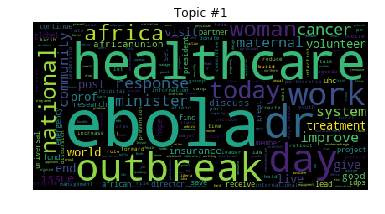
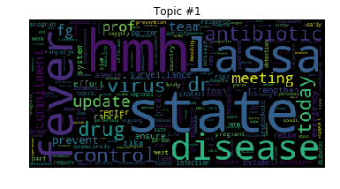

# TwitterTopicModeling

## Motivation
Access to the Internet is becoming more affordable especially in Africa and with this the
number of active social media users is also on the rise. Twitter is a social media platform
on which users post and interact with messages known as "tweets". These tweets are
usually short with a limit of 280 characters. With over 100 million Internet users and 6
million active monthly users in Nigeria, lots of data is generated through this medium
daily. This thesis aims to gain insights from the ever-growing Nigerian data generated
from twitter using Topic modelling. We use Latent Dirichlet Allocation (LDA) on Nigerian
heath tweets from verified accounts covering time period of 2015 – 2019 to derive top
health topics in Nigeria. We detected the outbreaks of Ebola, Lassa fever and meningitis
within this time frame. We also detected reoccurring topics of child
immunization/vaccination. Twitter data contains useful information that can give insights
to individuals, organizations and the government hence it should be further explored and
utilized.

## Topic Modelling
Given a text data set; usually a collection of documents, one common task is to derive
the topics in that data. Topic modelling is the process of applying statistical models
(topic models) to extract the hidden / latent topics in the data. These models work by
getting the hidden patterns in the document collection. Existing topic models include:
* Latent Semantic Analysis (LSA)
* Probabilistic Latent Semantic Analysis (PLSA)
* Latent Dirichlet Allocation (LDA)
* Correlated Topic Model (CTM)
* Explicit semantic analysis
* Hierarchical Dirichlet process
* Non-negative matrix factorization

The usefulness of Twitter data has only been scratched on the surface so far. This is
because we can get information on nearly every topic of interest from Twitter; from
entertainment to politics and even religion.
Since Twitter has been available for the past thirteen years, it contains historical data on
different topics and hence can be used for a track historic trends in different fields.
In this work, we will be mining Nigerian Health Twitter data for the past five years to
derive different topic and possible trends using topic modelling.

## Topics using LDA
* 2015 - Ebola outbreak

* 2016 - Lasser fever outbreak

